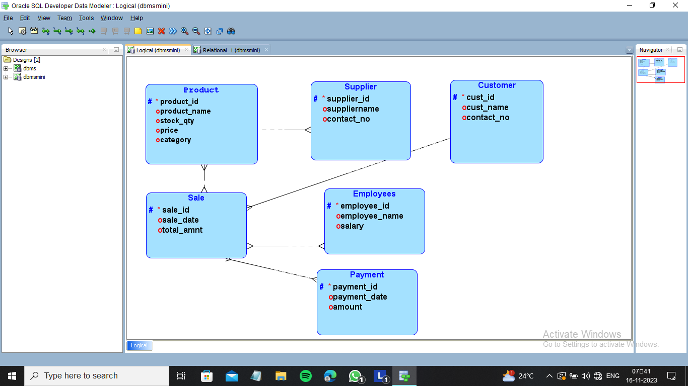
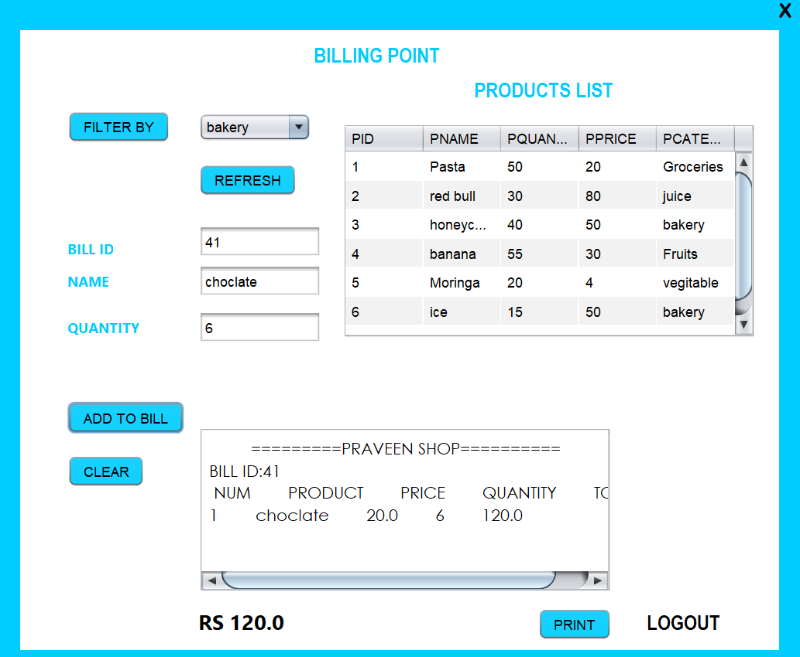
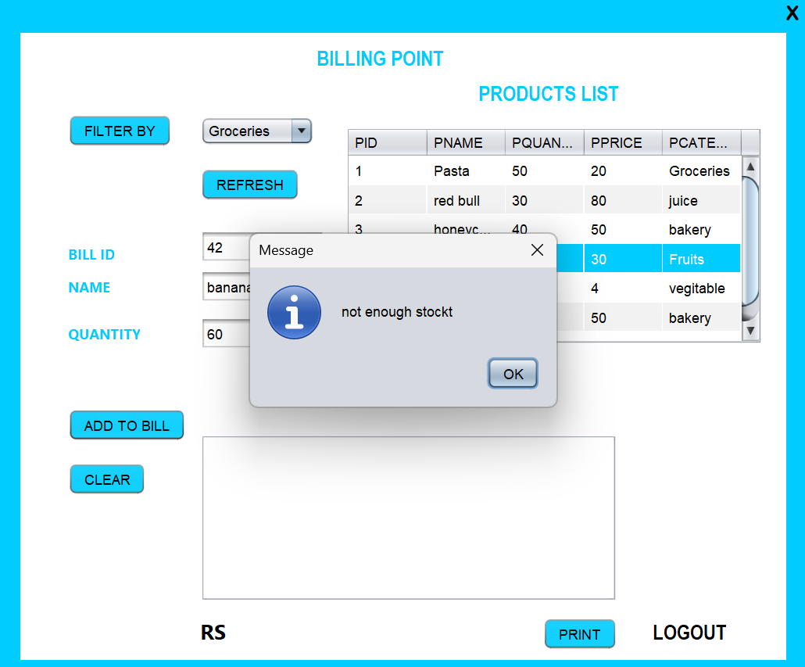
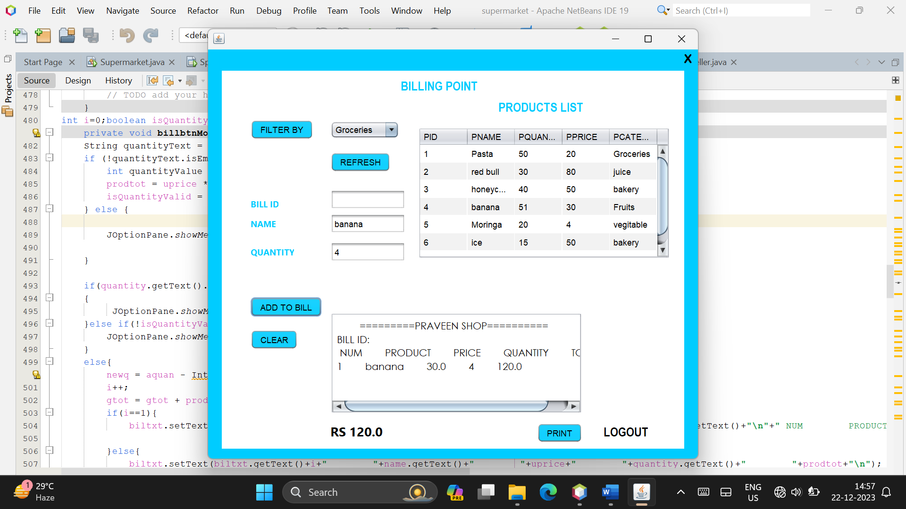

# 🛒 Inventory Management System


> A desktop-based supermarket inventory and billing application built with Java Swing and Oracle Database. It helps admins and staff manage products, categories, sellers, login access, and billing workflows in one place.

## ✨ Highlights
- Role-based login (Admin / Employee)
- Manage products, categories, and sellers
- Billing screen with category filtering and printable bills
- Oracle DB integration (JDBC)
- NetBeans GUI forms

## 📚 Table of Contents
- [Project Overview](#project-overview)
- [Tech Stack](#tech-stack)
- [Features](#features)
- [Screenshots](#screenshots)
- [Getting Started](#getting-started)
  - [Prerequisites](#prerequisites)
  - [Build & Run](#build--run)
  - [Configuration](#configuration)
- [Usage](#usage)
- [Project Structure](#project-structure)
- [Troubleshooting](#troubleshooting)
- [Contributing](#contributing)
- [License](#license)

## 📌 Project Overview
This project provides a GUI-based inventory management system for a supermarket use case. It includes role-based login, product and category management, seller management, and bill generation.

## 🧰 Tech Stack
- **Language:** Java (JDK 21)
- **UI:** Java Swing (NetBeans GUI Forms)
- **Database:** Oracle XE (JDBC Thin driver)
- **Build Tool:** Apache Ant (`build.xml`)
- **Project Type:** NetBeans Java SE project

## 🚀 Features
- 🔐 Role-based login (`Admin` / `Employee`)
- 📦 Product management (add, edit, delete, list)
- 🗂️ Category management (add, edit, delete, list)
- 👥 Seller management (add, edit, delete, list)
- 🧾 Billing screen with product selection and bill text generation
- 🔎 Category-based product filtering while billing
- 📉 Quantity validation and stock update via Oracle stored procedure/function calls
- 🌟 Splash screen startup flow

## 🖼️ Screenshots
All screenshots are rendered at the same size for consistency.

**Login & Entry**




**Product / Category / Seller Management**


**Billing Flow**








## ⚙️ Getting Started

### ✅ Prerequisites
Install the following before running the application:
- Java JDK **21**
- Apache Ant
- Oracle Database XE (or compatible Oracle instance)
- Oracle JDBC driver (`ojdbc8.jar`)
- NetBeans (recommended for easiest GUI form execution)

### ▶️ Build & Run
```bash
git clone https://github.com/kishore-cr7/Inventory-Management-System.git
cd Inventory-Management-System
ant clean jar
```

Then run the GUI entry point:
- `supermarket.Splash` (opens splash then login)

### 🔧 Configuration
This codebase uses direct Oracle connection strings and credentials in source files (for example in `src/supermarket/*.java`).

Update these values for your environment:
- URL: `jdbc:oracle:thin:@localhost:1521:xe`
- User: `system`
- Password: `<configured in source>`

Ensure the required Oracle tables/procedures/functions exist (`admin`, `selltable`, `category`, `product`, and billing-related DB objects used by the app).

## ▶️ Usage
1. Start the app from `supermarket.Splash`.
2. Login as **Admin** or **Employee**.
3. Admins can manage products/categories/sellers and open billing.
4. Employees can open billing, filter by category, and print bills.

## 🧭 Project Structure
```text
Inventory-Management-System/
├── src/
│   ├── supermarket/
│   │   ├── Splash.java
│   │   ├── login.java
│   │   ├── Product.java
│   │   ├── category.java
│   │   ├── seller.java
│   │   ├── selling.java
│   │   └── Updateadmin.java
│   ├── AbbApp.java
│   ├── LoginModule.java
│   ├── Pinentry.java
│   └── ...
├── Screenshots/
├── build.xml
└── Report.docx
```

## 🧯 Troubleshooting
- **`invalid target release: 21` during Ant build**  
  Install JDK 21 and set `JAVA_HOME` to that JDK.
- **`ClassNotFoundException: oracle.jdbc.driver.OracleDriver`**  
  Add `ojdbc8.jar` to project libraries/classpath.
- **Login always fails**  
  Verify DB is running and `admin` / `selltable` records match entered credentials.
- **Billing quantity update fails**  
  Check Oracle stored procedure/function names and permissions.

## 🤝 Contributing
If you find issues, open a GitHub Issue with:
- clear reproduction steps
- expected behavior
- actual behavior
- screenshots/logs (if available)

## 📄 License
This repository currently does **not** include a license file.
If you are the maintainer, add a `LICENSE` file (for example MIT) and update this section with the link.
