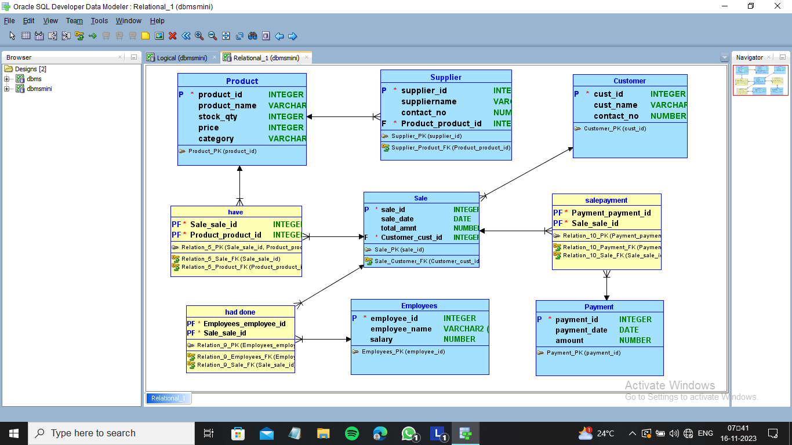
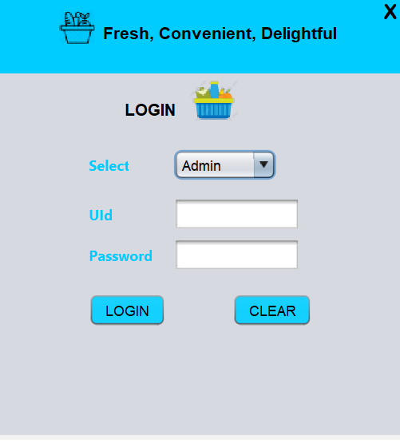
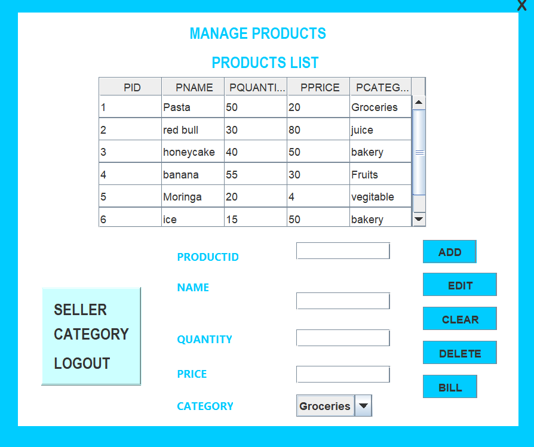
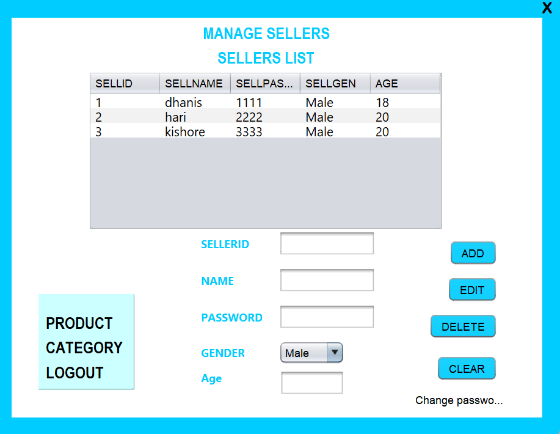
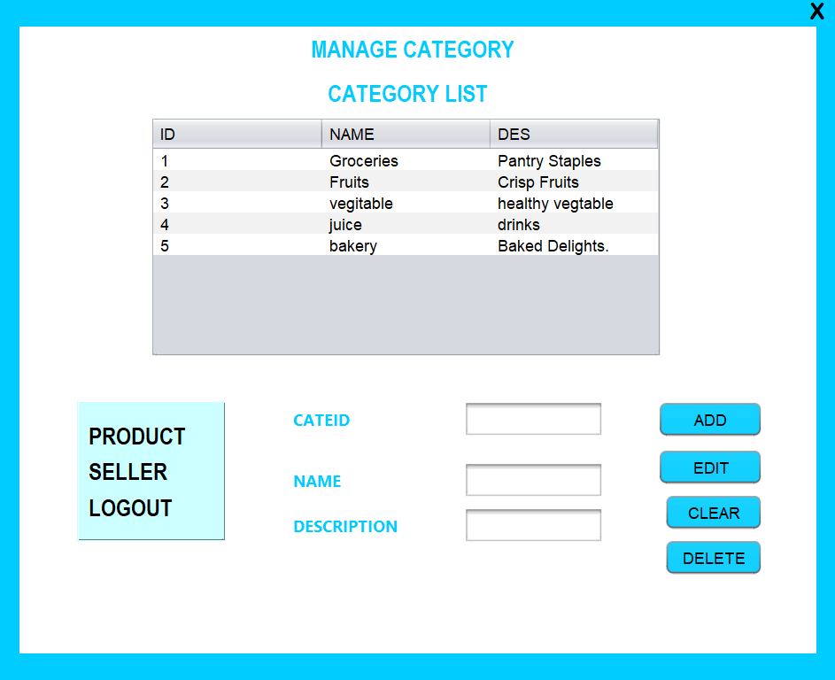
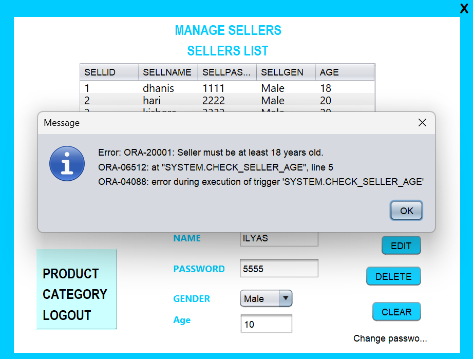
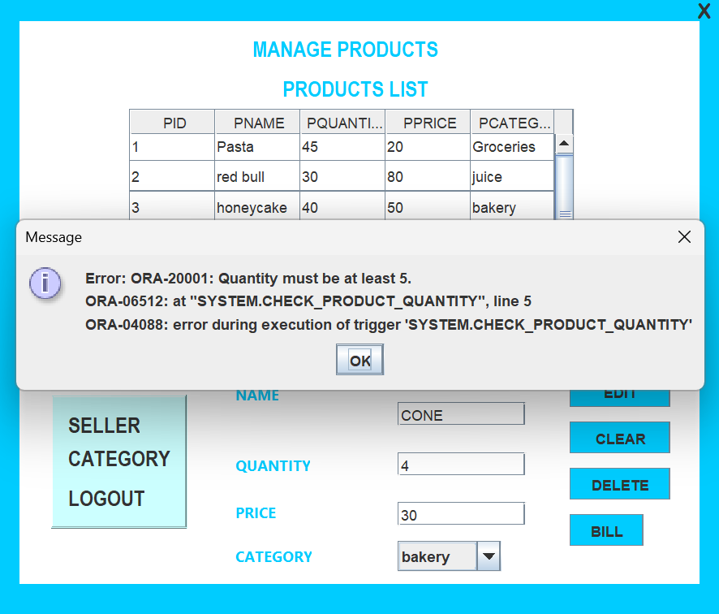
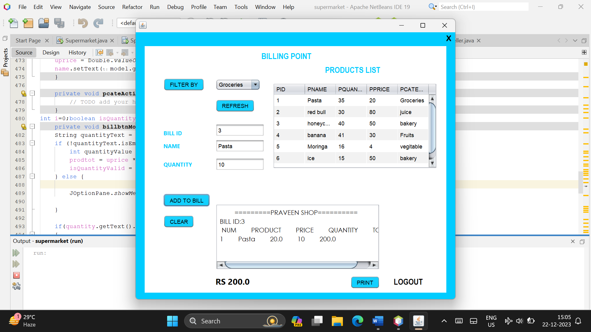

# 🛒 Inventory Management System


> ✨ A desktop-based supermarket inventory and billing application built with Java Swing and Oracle Database.  
> It helps admins and staff manage products, categories, sellers, login access, and billing workflows in one place.

## 📚 Table of Contents
- [Project Overview](#project-overview)
- [Tech Stack](#tech-stack)
- [Features](#features)
- [Visuals](#visuals)
- [Getting Started](#getting-started)
  - [Quick Start](#quick-start)
  - [Prerequisites](#prerequisites)
  - [Installation](#installation)
  - [Configuration](#configuration)
- [Usage Instructions](#usage-instructions)
- [Database Checklist](#database-checklist)
- [Troubleshooting](#troubleshooting)
- [Project Structure](#project-structure)
- [Contributing](#contributing)
- [License](#license)
- [Acknowledgments](#acknowledgments)

## 📌 Project Overview
This project provides a GUI-based inventory management system for a supermarket use case. It includes role-based login, product and category management, seller management, and bill generation using data persisted in Oracle tables.

## 🧰 Tech Stack
- **Language:** Java
- **UI:** Java Swing (NetBeans GUI Forms)
- **Database:** Oracle XE (JDBC Thin driver)
- **Build Tool:** Apache Ant (`build.xml`)
- **Project Type:** NetBeans Java SE project

## 🚀 Features
- 🔐 Role-based login (`Admin` / `Employee`)
- 📦 Product management (add, edit, delete, list)
- 🗂️ Category management (add, edit, delete, list)
- 👥 Seller management (add, edit, delete, list)
- 🧾 Billing screen with product selection and bill text generation
- 🔎 Category-based product filtering while billing
- 📉 Quantity validation and stock update via Oracle stored procedure/function calls
- 🌟 Splash screen startup flow

## 🖼️ Visuals
Screenshots extracted from `Report.docx`:

### 🔑 Login & Entry Screens


### 🛠️ Product / Category / Seller Management






### 💳 Billing and Additional Flows







## ⚙️ Getting Started

### ⚡ Quick Start
If you already have Java, Ant, Oracle XE, and JDBC jars:

```bash
git clone https://github.com/kishore-cr7/Inventory-Management-System.git
cd Inventory-Management-System
ant clean jar
```

Then run `supermarket.Splash` from your IDE (recommended) or run classes with a classpath that includes Oracle JDBC.

### ✅ Prerequisites
Install the following before running the application:
- Java JDK **21** (project is configured for source/target 21)
- Apache Ant
- Oracle Database XE (or compatible Oracle instance)
- Oracle JDBC driver (`ojdbc8.jar`)
- NetBeans (recommended for easiest GUI form execution)

Optional environment variables:
- `JAVA_HOME` (points to JDK 21)
- `ORACLE_HOME` / Oracle client setup (if required by your local Oracle installation)

### 📥 Installation
```bash
git clone https://github.com/kishore-cr7/Inventory-Management-System.git
cd Inventory-Management-System
```

If using NetBeans:
1. Open the project folder.
2. Resolve missing libraries in project properties (Oracle JDBC and other referenced jars).
3. Build and run.

If using command line (Ant):
```bash
ant clean
ant jar
```

### 🔧 Configuration
This codebase currently uses direct Oracle connection strings and credentials in source files (for example in `src/supermarket/*.java`):
- URL: `jdbc:oracle:thin:@localhost:1521:xe`
- User: `system`
- Password: `<configured in source>`

Before running in your environment:
1. Update DB URL/username/password to your local values.
2. Ensure required Oracle tables/procedures/functions exist (`admin`, `selltable`, `category`, `product`, and billing-related DB objects used by the app).
3. Ensure JDBC jars are available on classpath.
4. Ensure Oracle sequence/function/procedure objects used in billing are present (for example `bill_id_seq`, `IS_QUANTITY_VALID`, `update_product_quantity`).

## ▶️ Usage Instructions

### 1) 🏁 Start the GUI application
Recommended entry point:
- `supermarket.Splash` (opens splash then login)

From IDE: run `Splash.java`.

From command line (example):
```bash
# Build first
ant clean jar

# Run Splash class (adjust classpath/jar locations if needed)
java -cp "build/classes:<path-to-ojdbc8.jar>:<path-to-rs2xml.jar>" supermarket.Splash
```

### 2) 🔑 Login
- Choose role: `Admin` or `Employee`
- Enter credentials from corresponding DB table (`admin` or `selltable`)

### 3) 👨‍💼 Admin workflow
- Manage products
- Manage categories
- Manage sellers
- Navigate to billing screen

### 4) 👨‍🔧 Employee workflow
- Open billing screen
- Filter products by category
- Add items to bill
- Print/complete billing flow

## 🗃️ Database Checklist
Before first run, verify:
- `admin` table has at least one valid admin user
- `selltable` has seller records for Employee login
- `category` has available categories
- `product` has product rows linked to categories
- Billing DB objects (`bill_id_seq`, quantity validation function, quantity update procedure) are created

## 🧯 Troubleshooting
- **`invalid target release: 21` during Ant build**  
  Install JDK 21 and set `JAVA_HOME` to that JDK.
- **`ClassNotFoundException: oracle.jdbc.driver.OracleDriver`**  
  Add `ojdbc8.jar` to project libraries/classpath.
- **Login always fails**  
  Verify DB is running and `admin` / `selltable` records match entered credentials.
- **Billing quantity update fails**  
  Check Oracle stored procedure/function names and permissions.

## 🧭 Project Structure
```text
Inventory-Management-System/
├── src/
│   ├── supermarket/
│   │   ├── Splash.java
│   │   ├── login.java
│   │   ├── Product.java
│   │   ├── category.java
│   │   ├── seller.java
│   │   ├── selling.java
│   │   └── Updateadmin.java
│   ├── AbbApp.java
│   ├── LoginModule.java
│   ├── Pinentry.java
│   └── ...
├── assets/
│   └── screenshots/
├── build.xml
└── Report.docx
```

## 🤝 Contributing
This project is currently maintained by **Kishore** as the sole contributor.

If you find issues, open a GitHub Issue with:
- clear reproduction steps
- expected behavior
- actual behavior
- screenshots/logs (if available)

## 📄 License
This repository currently does **not** include a license file.
If you are the maintainer, add a `LICENSE` file (for example MIT) and update this section with the link.

## 🙏 Acknowledgments
- Kishore (project owner and sole contributor)
- NetBeans GUI Builder for Swing form scaffolding
- Oracle Database/JDBC ecosystem used by the application
- Screenshots sourced from `Report.docx`
